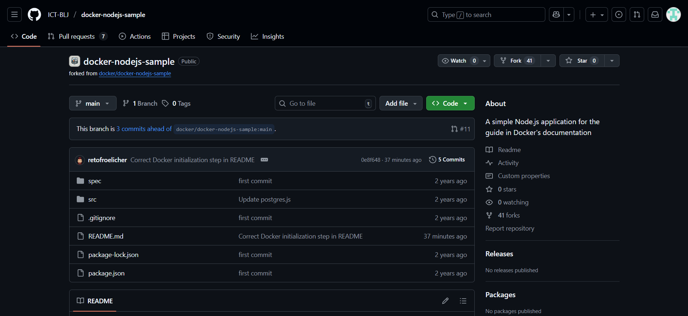

# Anleitung zur Erstellung einer ToDo-Applikation mit Markdown, Git, GitHub und Docker

### Klonen des Repositories

Zuerst erstelle ich ein Fork des Zielrepositorien.

Danach öffne ich Visual Studio Code und drücke ctrl + shift + P, um die Suchleiste zu öffnen.

Als nächstes schreibe ich «Git: Clone» in die Suchleiste. Das zwingt mich meinen Visual Studio Account mit meinem Github Account zu verbinden.

Nachdem ich das gemacht habe, sehe ich alle meine Repositorien in der Suchleiste und wähle das richtige aus. Wenn das erledigt ist, wähle ich den Zielort meines Repositoriums in meinem Datei Explorer aus.

### "Docker-Konfiguration und -Installation"

Installiere [Docker](https://www.docker.com/products/docker-desktop/) und [Docker für Visual Studio Code](https://marketplace.visualstudio.com/items?itemName=ms-azuretools.vscode-docker)

Vor der Installation fragt es Sie welche Punkte erfüllt sein sollen. Sie können hier die Standardeinstellung lassen und fortfahren.

Docker fragt Sie nach der Installation ob Sie sich anmelden wollen. Das ist nicht notwendig aber Sie können es machen.

Wenn Docker installiert ist, wird dein Computer sehr wahrscheinlich einen Neustart durchführen müssen, weil es WSL 2 nicht hat.

### Installation der notwendigen Pakete

Öffne im docker-nodejs-sample directory den Terminal und lass den Command "docker init" laufen.

Danach spuckt das Terminal folgendes aus (Hinter den Fragen ist die Antwort die Sie auswählen/eingeben müssen):

docker init
Welcome to the Docker Init CLI!

This utility will walk you through creating the following files with sensible defaults for your project:

- .dockerignore
- Dockerfile
- compose.yaml
- README.Docker.md

Let's get started!

? What application platform does your project use? Node
? What version of Node do you want to use? 18.0.0
? Which package manager do you want to use? npm
? What command do you want to use to start the app: node src/index.js
? What port does your server listen on? 3000

Danach sollte dein Directory folgende Dateien haben:

docker-nodejs-sample/
 spec/
 src/
 .dockerignore
 .gitignore
 compose.yaml
 Dockerfile
 package-lock.json
 package.json
 README.md

### Starten der Applikation in einem Docker-Container

Lass im Terminal den Command "docker compose up --build" laufen.

Wenn Sie den Downloadprozess nicht sehen wollen, benutzen Sie den Command "docker compose up --build -d".

Öffne danach einen Browser und schaue dir die Applikation [http://localhost:3000/](http://localhost:3000/) an.

Um die Applikation wieder zu schliessen, öffnen Sie das Terminal und drücke "ctrl + C".
